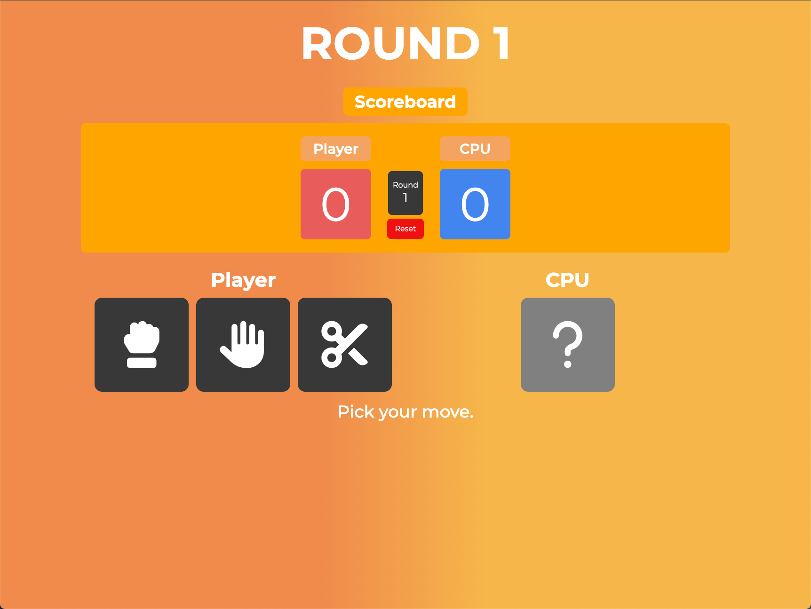

# ✊🖐️✌️ Rock Paper Scissors

This is a simple **Rock Paper Scissors** game built using **HTML**, **CSS**, and **JavaScript**.  
The user can play against the computer, which randomly selects between rock, paper, or scissors each round.  
The game keeps track of the player and computer scores and displays the winner after each round.

## ✨ Features
- Play Rock, Paper, Scissors against the computer  
- Real-time score tracking  
- Dynamic UI updates with each round  
- Random computer choices for fairness  
- Simple and responsive design  

## 💡 Purpose
This project was created to practice:
- Basic control flow and logic in JavaScript  
- Handling user input and updating the DOM dynamically  

## 🚀 How to Run
1. Clone or download this repository  
2. Open `index.html` in your browser  
3. Click on a move (rock, paper, or scissors) to start playing!  

## 📸 Preview

---

### Credits
- **Icons:** [rpsgame.org](https://www.rpsgame.org/)  
- **Scoreboard Inspiration:** [CodePen by daffy](https://codepen.io/dafdy/pen/zYxRPQJ)